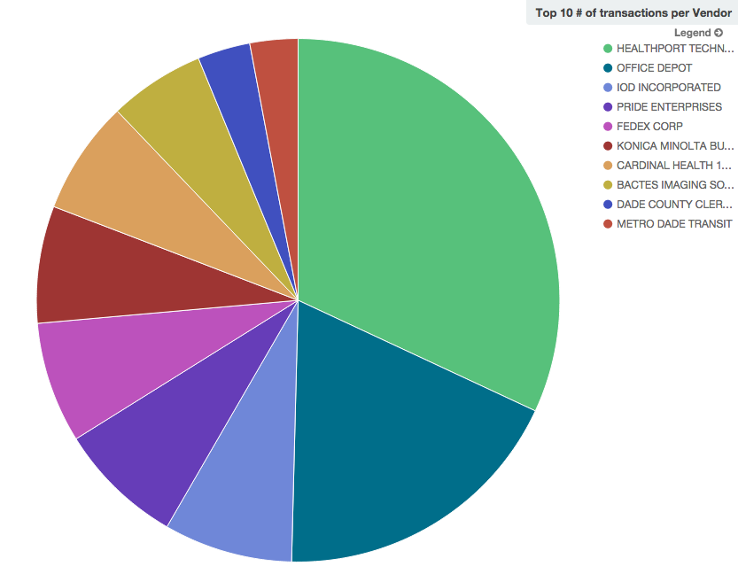

# Datamnom

tl;dr: Generic data ingestion for [Elasticsearch](https://www.elastic.co/products/elasticsearch) to be visualized by [Kibana](https://www.elastic.co/products/kibana).

Originally created for a local [Hack for Change event](https://medium.com/zumba-tech/zumbatech-takes-on-hackforchange-f8e8ebdc14d7#.2vfjxtk03), this project aims to get quick visualizations via Kibana that look like this:

> Pie chart above produced in Kibana from an import of [Florida Vendor data](https://github.com/cjsaylor/datamnom/wiki/Florida-Vendor-Data) that was open sourced by FL state government.

## Requirements

* VirtualBox `4.3+` (if on non-Linux machine)
* Docker `1.8+`
* Docker Compose `1.5+`
* NodeJS `4.0+`

## Install

* `docker-compose up -d`
* `npm install`

## Use

* Access locally: http://192.168.99.100:5601/. You can retrieve your docker IP via `docker-machine env dev` if you machine name is `dev`. If your docker deamon is running on the host machine (ie on Linux), then your address will simply be http://localhost:5601.
* Add `json` configuration to `inbound/`, right now hardcoded to [`FY2013.json`](https://github.com/cjsaylor/datamnom/wiki/Florida-Vendor-Data).
* Copy  into `inbound/` folder and run `node bin/datamnom.js` for flat TXT file import.
* See [the wiki](../../wiki) for specific use-cases

# Troubleshooting Install

__Kibana is working but it's asking for index__
* Replace `logstash-*` with the index specific to the dataset import.  See the [wiki](../../wiki) for specific use-cases.

__Kibana is working but I see `No Results Found`__
* Top-right corner, change time frame from `Last 15 minutes` to a time scale that encompasses the imported data.
